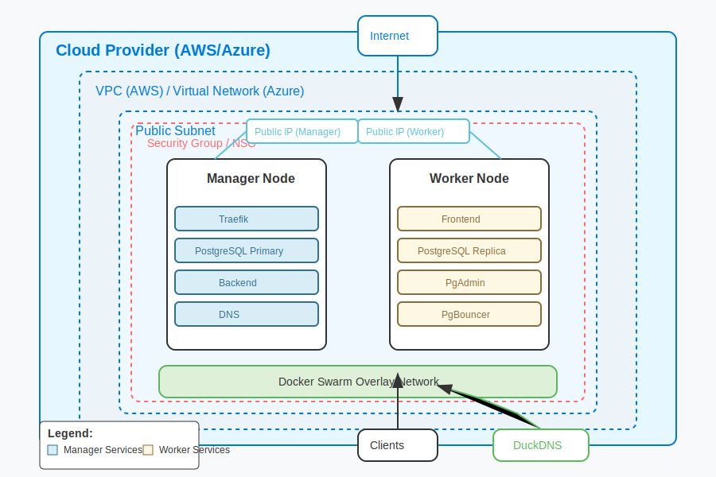
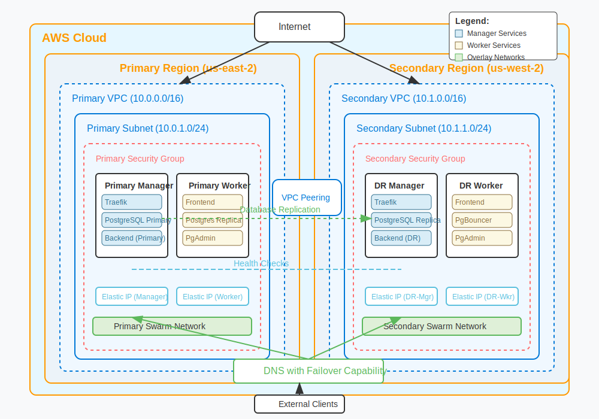

# CP-Planta Infrastructure

[](https://github.com/Saccilotto-AGES-Projects/AGES-III-CP-Planta-Infra/blob/main/.github/workflows/auto-update.yml)
[](https://github.com/Saccilotto-AGES-Projects/AGES-III-CP-Planta-Infra/blob/main/.github/workflows/full_deployment.yml)

Cloud-agnostic Infrastructure as Code (IaC) and Configuration as Code (CaC) for the CP-Planta application, supporting AWS and Azure platforms with Docker Swarm orchestration.

## Overview

CP-Planta Infrastructure provides an automated deployment pipeline for a containerized application stack with:

- **Multi-cloud support**: Deploy to AWS or Azure with the same code base
- **High availability**: Single or multi-region deployments with failover capability
- **Containerization**: Docker Swarm orchestration with service replication
- **Database resilience**: PostgreSQL with primary-replica replication
- **Automated DevOps**: GitHub Actions workflows for CI/CD
- **Secure access**: Automatic SSL certificate generation via Let's Encrypt

## Architecture Diagrams

### Simple Infrastructure Diagram (AWS or Azure)



### Multi-Region Infrastructure Diagram (AWS)



## Quick Start

### Prerequisites

- [Terraform](https://www.terraform.io/downloads.html) (v1.0.0+)
- [Ansible](https://docs.ansible.com/ansible/latest/installation_guide/intro_installation.html) (v2.9+)
- [AWS CLI](https://aws.amazon.com/cli/) or [Azure CLI](https://docs.microsoft.com/en-us/cli/azure/install-azure-cli)
- [Docker](https://docs.docker.com/engine/install/) (for local testing)

### Deployment

1. Clone the repository:

   ```bash
   git clone https://github.com/Saccilotto/AGES-III-CP-Planta-Infra.git
   cd AGES-III-CP-Planta-Infra
   ```

2. Create your environment file:

   ```bash
   ./secrets-manager.sh template
   cp .env.example .env
   # Edit .env with your cloud credentials
   ```

3. Deploy to your chosen cloud:

   ```bash
   # For AWS
   ./deploy.sh --provider aws --regions single
   
   # For Azure
   ./deploy.sh --provider azure --regions single
   ```

4. Access your application via the displayed endpoints.

## Project Structure

```plaintext
CP-Planta-Infra/
├── .github/workflows/     # GitHub Actions workflows
├── ssh_keys/              # Generated SSH keys (gitignored)
├── Swarm/                 # Docker Swarm configuration
├── TerraformAWSSingle/    # Single-region AWS config
├── TerraformAWS/          # Multi-region AWS config
├── TerraformAzure/        # Azure config for single region
├── *.sh                   # Deployment and utility scripts
├── *.md                   # Documentation
├── .env                   # Environment variables (gitignored)
└── *.example              # Variable files' templates
```

## Core Components

- **Infrastructure**: AWS EC2 or Azure VMs with appropriate networking
- **Orchestration**: Docker Swarm for container management
- **Database**: PostgreSQL database
- **Frontend**: React-based UI
- **Backend**: Node.js API
- **Reverse Proxy**: Traefik with automatic SSL
- **Monitoring**: Container visualizer and monitoring tools

## Documentation

- [README.md](./README.md) - This overview file
- [DEPLOYMENT.md](./DEPLOYMENT.md) - Comprehensive deployment instructions
- [CLI-REFERENCE.md](./CLI-REFERENCE.md) - Detailed command-line reference

## Contributing

Contributions are welcome! Please feel free to submit a Pull Request.

1. Fork the repository
2. Create your feature branch (`git checkout -b feature/amazing-feature`)
3. Commit your changes (`git commit -m 'Add some amazing feature'`)
4. Push to the branch (`git push origin feature/amazing-feature`)
5. Open a Pull Request

## License

This project is licensed under the AGPL License - see the [LICENSE](LICENSE) file for details.

## Acknowledgments

- André Sacilotto Santos - Lead Developer and Software Architect during MVP (AGES III)
- Agência Experimental de Engenharia de Software (AGES) - Project Scope and Stakeholders Management
- Hortti - Original Project Idea and Business Requirements
